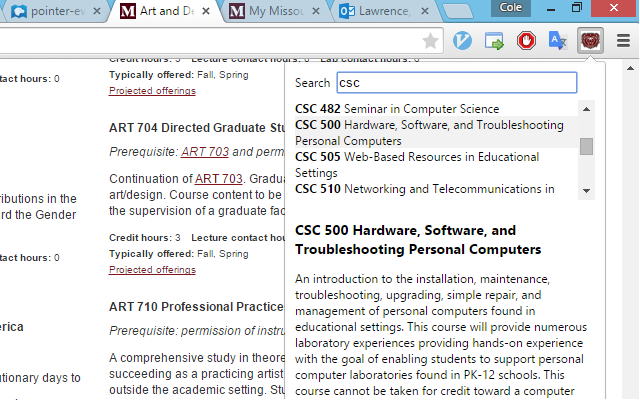

# MOState Course Sort

The course sort application is useful for people attempting to organize different classes and their prerequisites in the MissouriState course catalog.

<center>
 
</center>
<center>
 
</center>

## Scraping and Compiling the Catalog
> This utility uses an offline database of the entire Missouri State course catalog in order to look up courses quickly. That file is generated under `extension/all_catalog.json`.

### Set-up
 1. Ensure that [Node.js](https://nodejs.org/download/) is installed on the path.
 2. Ensure that [coffee-script](http://coffeescript.org/) is installed globally
  
  ```shell
  npm install -g coffee-script
  ```

### Compiling
 1. Retrieve the catalog department page urls (These are stored as `data.json`)
  
  ```shell
  coffee retrieve-catalogs.coffee
  ```
 2. Scrape course information from department pages (stored as `extension/all_catalog.json`)
  
  ```shell
  coffee retrieve-courses.coffee
  ```

## Compiling the extension
> Need to have node.js installed

### Set-up
 1. Install the dependencies of this node.js project using:
  
  ```shell
  cd course-sort
  npm install
  ```

### Compiling extension files
> The extension source files located under `extension-src` overwrite some files under `extension`.

 1. Use `compile-extension.cmd` on Windows or `bash compile-extension.cmd` on Unix
